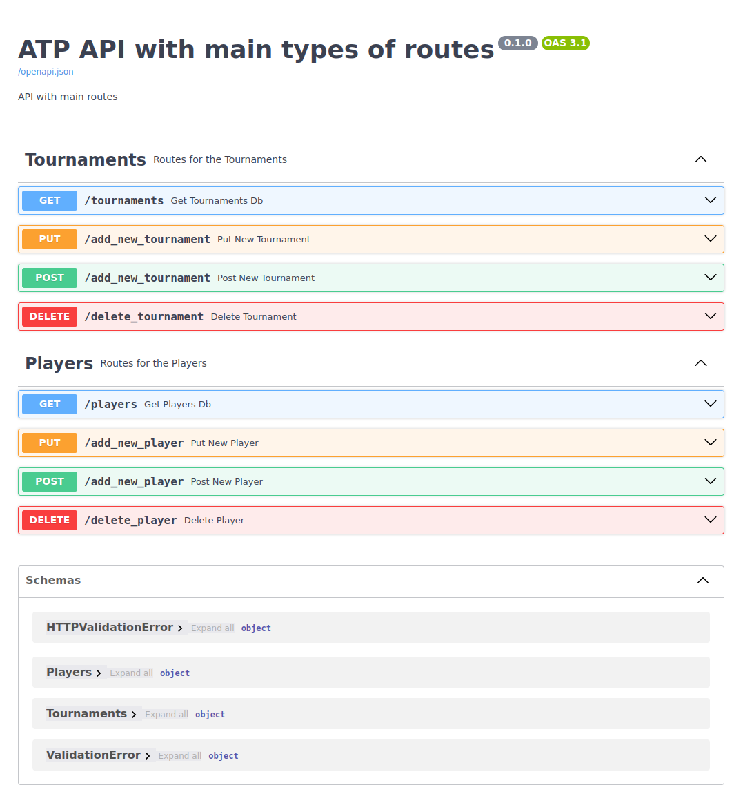

# FastAPI

# Overview
Repo to practice the building of all main routes in an API using ATP tennis male match datas.

# Prework

From the csv file, it will be created a database of the ATP tournaments and a database of the different players involved in the games.

# API Structure

## Get Routes

With those routes we can access the database of tournaments and players.

## Post and Put routes

With those routes, we can add new players or new tournaments.

## Delete routes

Here it is possible to delete some retired players or tournaments not in the ATP calendar anymore.

# Screenshot

# Note

The route put new player would not be constructed this way in a real case scenario. Here we created a new player and add to the player database. In a real case scenario, a new match would be added to the data_raw file with this new player involved. We just want to test a code for a put/post and delete route.

